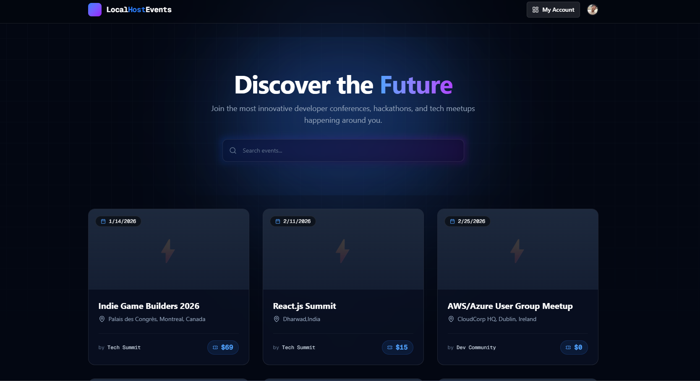
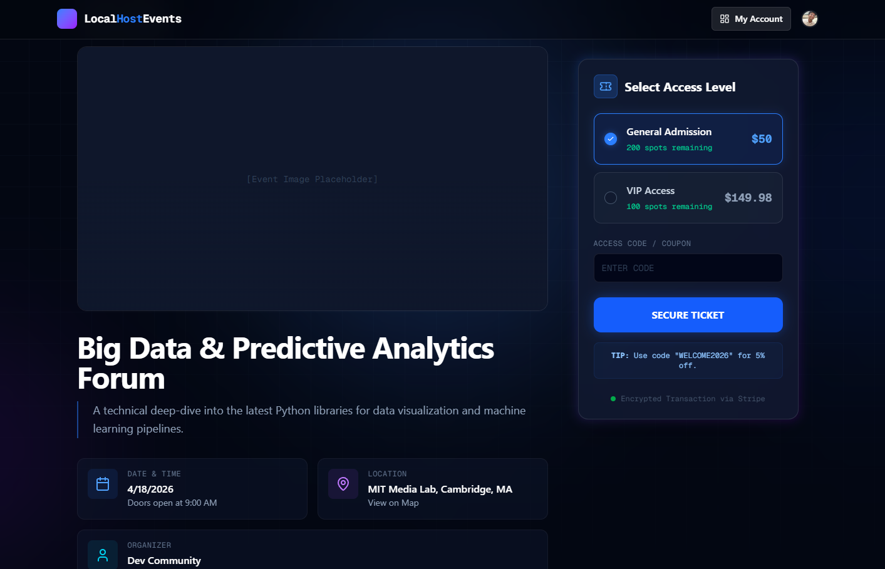
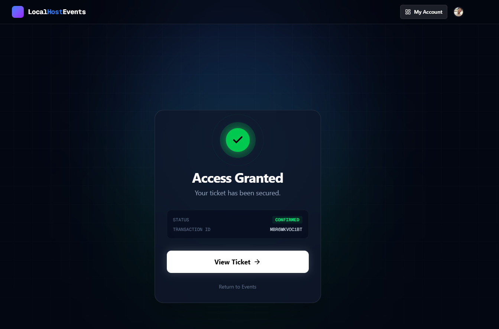
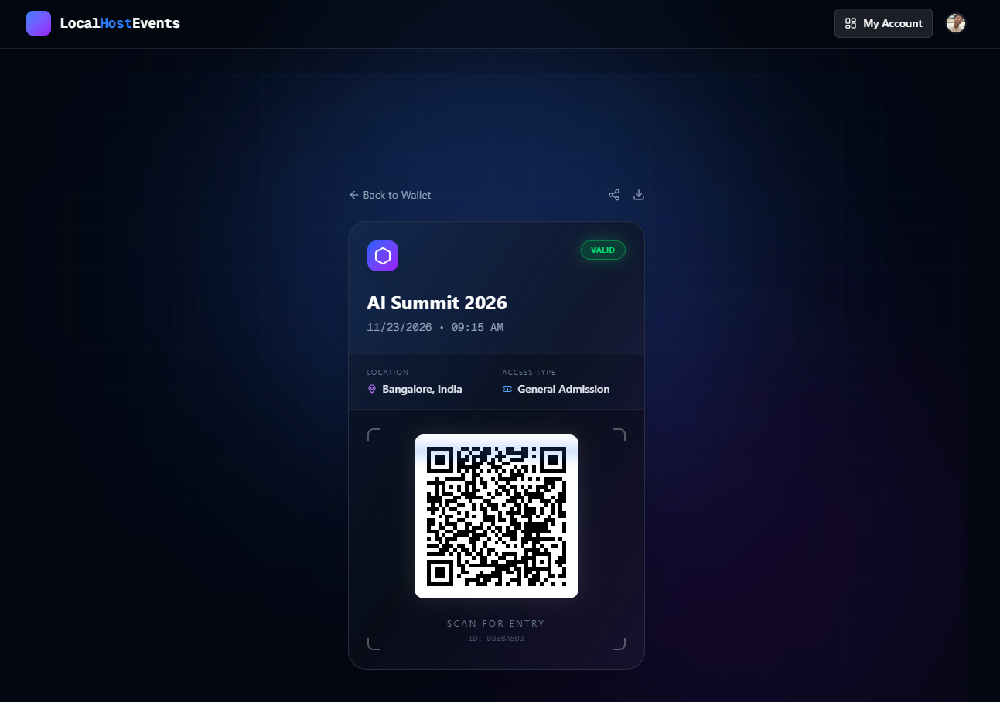
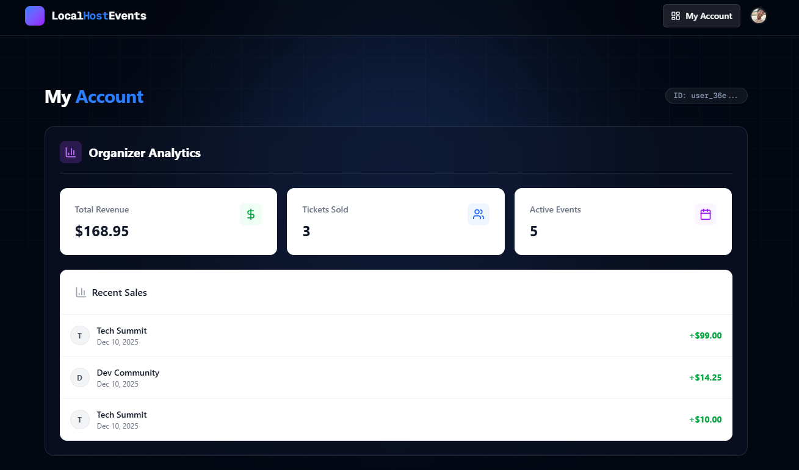
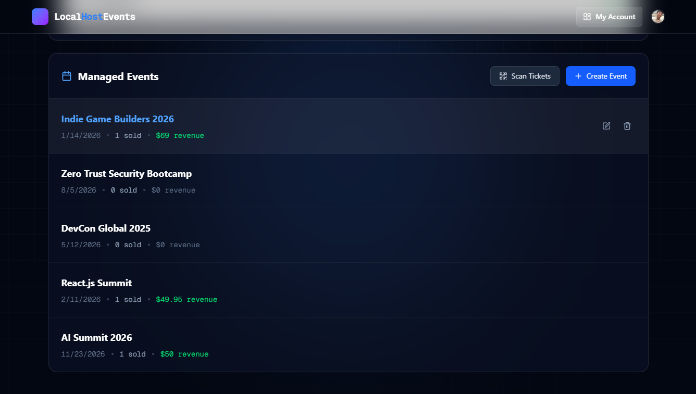

# Local Host Events

A production-ready, scalable event booking platform built with modern technologies to handle real-time ticket sales, secure payments, and digital gate management. This project specifically solves challenges around concurrency control for ticket inventory, robust authentication flows, and reliable payment verification.

**Project Link:** [https://local-host-events.pavicodes.in](https://local-host-events.pavicodes.in)

## Table of Contents
- [Tech Stack](#tech-stack)
- [Features](#features)
- [Database Schema](#database-schema)
- [Screenshots](#screenshots)
- [System Workflows](#system-workflows)
- [Concurrency & Inventory Safety](#concurrency--inventory-safety)
- [Environment Variables](#environment-variables)

## Tech Stack

- **Framework:** Next.js 15 (App Router, Server Actions)
- **Language:** TypeScript
- **Styling:** Tailwind CSS + Lucide Icons
- **Database:** PostgreSQL (hosted on Supabase)
- **ORM:** Prisma
- **Authentication:** Clerk (OAuth 2.0, Role Management)
- **Payments:** Stripe
- **Deployment:** Vercel

## Features

- Authentication with Clerk (Google & Email login)
- Role-Based Access Control (Admins and Users)
- Real-time Inventory Management preventing overselling
- Stripe integration with pull-based session verification (no webhooks)
- Digital ticket generation with unique QR codes
- Admin QR gate scanning system for ticket validation
- Server-side search and pagination for event browsing
- Email notifications for ticket purchase confirmation

## Database Schema

The normalized schema tightly links users, events, orders, tickets, and ticket variants with strict foreign keys to maintain referential integrity.
> *See `prisma/schema.prisma` for the full definition.*

<p align="center">

</p>

## Screenshots

| Event Listing & Search | Event Detail & Ticket Selection | Checkout Success Page |
| :--------------------: | :-----------------------------: | :-------------------: |
|  |  |  |

| Digital Ticket with QR Code | Admin Dashboard | Event Management |
| :-------------------------: | :-------------: | :--------------: |
|  |  |  |

## System Workflows

### 1. Authentication & User Sync (Clerk)
Instead of relying on fragile webhooks, this project implements a robust **"Sync-on-Login"** pattern.

1.  **Login:** User signs in via Clerk (Google/Email).
2.  **Lazy Sync:** On page load, a lightweight Server Action (`syncUser`) checks if the user exists in the Supabase `User` table.
3.  **Atomic Creation:** If missing, the user is instantly created in the database, ensuring foreign key constraints (like `organizerId`) never fail.

### 2. Purchase Flow (Stripe & Ticket Generation)
The payment system uses a secure "Pull-Based" verification pattern rather than webhooks.

1.  **Checkout:** User selects tickets → Redirected to Stripe Hosted Checkout.
2.  **Verification:** User returns to `/success?session_id=...`.
3.  **Validation:** The server explicitly calls the Stripe API to verify the payment status (preventing URL spoofing).
4.  **Generation:** Once verified, the system performs a multi-table transaction:
    * Creates the **Order**.
    * Generates unique **Tickets** with QR codes.
    * Decrements **Stock**.

## Concurrency & Inventory Safety

### The "1 Ticket, 2 Users" Problem:
Without proper concurrency control, simultaneous purchases of the last ticket can cause overselling.

### Solution: Atomic Database Operations
- Stock decrements are done atomically at the database level.
- Implemented with Prisma’s atomic decrement:

- A database-level check constraint (`CHECK stock >= 0`) prevents stock from dropping below zero, ensuring data integrity without relying on JavaScript logic.

## Environment Variables

```
Database (Supabase Postgres)
DATABASE_URL="postgres://..."

Clerk Authentication
NEXT_PUBLIC_CLERK_PUBLISHABLE_KEY=pk_test_...
CLERK_SECRET_KEY=sk_test_...

Stripe Payments
NEXT_PUBLIC_STRIPE_PUBLISHABLE_KEY=pk_test_...
STRIPE_SECRET_KEY=sk_test_...

App Configuration
NEXT_PUBLIC_BASE_URL="http://localhost:3000"
```

